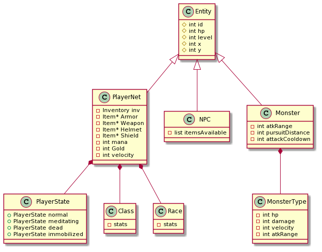
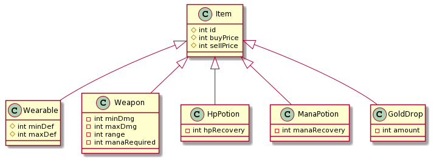
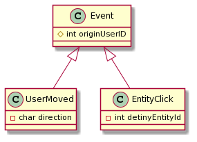

# Documentación Técnica

## Requerimientos de software

- **OS requerido**:

    - Linux

- **Bibliotecas requeridas**:
- msgpack: https://github.com/msgpack/msgpack-c/tree/cpp_master
    - SDL2: https://www.libsdl.org/
    - QT: https://www.qt.io/product/framework
    
- **Herramientas para la instalación del programa**:

    - g++
    - Makefile
    - CMake

- **Herramientas para compilación, desarrollo, prueba y depuración del programa**:

    - Algún compilador de C++, por ejemplo, g++.
    - Algún editor de texto o IDE, por ejemplo, Visual Studio Code.

## Descripción general

El programa consiste de dos aplicaciones, un servidor, y un cliente, cada uno de estos posee diversos modulos que interactuan entre si, a continuación se desarrollaran cada uno de estos modulos.

## Cliente:

### Flujo principal del cliente

Al inicializar el cliente, se inicia la pantalla de LogIn, el cual se divide en tres etapas:

- La primera etapa es la de la conexión al servidor. En esta pantalla se deberá ingresar host y puerto. Si el host y puerto son correctos, `ClientConnector` se encargará de conectarse al servidor solicitado.
- La segunda etapa es la del ingreso a la cuenta, donde se deberá ingresar usuario y contraseña. En esta etapa se enviarán mensajes al servidor con los datos ingresados hasta que sean correctos o la cuenta sea inexistente, en este caso el servidor se encargará de crearla.
- La tercera etapa se ejecuta solo en el caso de que la cuenta no existiese. Aquí se elige raza y clase, las cuales serán enviadas al servidor.

Una vez finalizada la etapa de LogIn, se finalizará la ejecución de QT y se procederá a inicializar el cliente a través de `ClientInitializer`. Aquí se inicializará la ventana principal en SDL, se obtendrán los datos del jugador, los datos del mapa principal y se inicializará el resto de componentes necesarios para la ejecución del loop del cliente.

Al finalizar la inicialización, se procede a la ejecución de este. En esta etapa se crearán 3 hilos, por lo que se usarán 4 hilos en total teniendo en cuenta el hilo principal. Estos 4 hilos están divididos en:

- EventManager: donde se procesan los eventos del usuarios y se los guarda en una cola, para luego ser enviados al servidor.
- Sender: donde se reciben los eventos procesados y se los envía al servidor.
- Receiver: donde se reciben eventos provenientes del servidor y se los guarda en una cola.
- Renderer/ModelController: donde se ejecuta el loop principal, actualizando el modelo con eventos provenientes del servidor (que se encuentran en la cola) y renderizando cada componente.

Cada hilo tiene donde dormir para no estar ejecutando innecesariamente.

- EventManager duerme en el `SDL_WaitEvent`, donde no procesa eventos si no los hay.
- Sender duerme en la cola asociada a EventManager.
- Receiver duerme en el `receive` del socket siempre que no haya mensajes entrantes.
- Renderer/ModelController duermen con la espera del ciclo del loop. Al final del ciclo se encuentra un `usleep` que duerme solo si es necesario hasta completar 30ms de ciclo. No se duerme más que eso ya que sino no se tendría un frame rate agradable al usuario.

### Módulo WRAP_SDL

Este módulo se encarga de wrappear las funcionalidades de SDL, para ser capaz de utilizarlo sin preocuparse de su funcionamiento interno, las clases que componen este módulo son

        - Texture
        - Image
        - FilteredImage
        - Text
        - Music
        - SoundEffect
        - MusicPlayer
        - SoundEffectPlayer

La clase Texture, encapsula el renderizado de una textura, y las clases Image, FilteredImage y Text descienden de esta, ya que tienen un comportamiento similar entre si, Image corresponde a una imagen en formato png o similar, mientras que FilteredImage corresponde a una imagen png, pero con la posibilidad de que esta se transparente en relación a su entorno, por último Text encapsula un texto, que para SDL, una vez elegido el texto, funciona exactamente igual que una textura.

Luego, la clase Music y la clase SoundEffect encapsulan la reproducción de musica y Chunks (efectos de sonido), estas representan una unica musica o efecto de sonido, por otro lado, MusicPlayer y SoundEffectPlayer, funcionan como un reproductor, el al cual se le pueden agregar canciones o sonidos respectivamente, y luego elegir cual reproducir entre ellos.

Diagrama de clases

Se agregó luego la clase MapImage, que hereda de Image. Esta clase de utiliza en la creación del mapa ya que cuenta con una funcionalidad extra `renderFromTile` que facilita el renderizado del mapa, ya que éste se guarda en una matriz de índices que indican qué tile debe ser renderizado para una cierta imagen.

### Módulo Layout

Este módulo consiste de todas las clases que intervienen en el manejo del layout, es decir, la interfaz gráfica del juego, estas clases son:

        - Layout
        - ExpBar
        - GraphicInventory
        - LayoutManager
        - MiniChat

La clase Layout posee el background de la interfaz, y se encarga de graficar todo lo relacionado con la vida, el mana, el oro y el nivel.
ExpBar, como lo indica su nombre, representa la barra de experiencia, la cuál son dos imagenes, una barra vacia y una llena, que se grafican una sobre la otra dependiendo la cantidad de experiencia que se tenga.
GraphicInventory representa el inventario, el cuál grafica los distintos objetos del inventario, y aquellos que se encuentran equipados, además es capaz de saber en que slot esta clickeando un usuario para seleccionar un item.
La clase MiniChat posee un historial de mensajes el cuál es graficado, y es capaz de, si el usuario presiona ENTER, graficar dinamicamente lo que el usuario va escribiendo, y una vez presionado ENTER nuevamente, ese mensaje se agrega al historial, por lo que se grafica junto a los demas.
Por último la clase LayoutManager, se encarga de decodificar los mensajes llegados desde el servidor, y llamar a las funciones correspondientes de las clases explicadas anteriormente.

### Módulo Login

Este módulo representa la pantalla de Login o el Launcher, consiste en las siguiente clases

        - LogIn
        - LogInController

La clase LogIn es la que implementa la pantalla de Login, utilizando la libreria QT, en esta pantalla, primero se selecciona el servidor al cual se quiere conectar, obteniendo un mensaje de error si este no es valido, una vez conectado se ingresa el usuario y contraseña,junto con el tamaño de la ventana que querra que tenga el juego, en caso de que el usuario exista y la contraseña sea incorrecta se le notificara el error, si el usuario no existe, se pasara a la pantalla de creacion de personaje, en la que se debera seleccionar la raza, la clase, luego de esto, o si el usuario ya existia y la contraseña era correcta, la aplicacion finaliza.

LogInController se encarga de inicializar el LogIn y ejecutar la Qapplication, para que la ventana pueda correr, y devuelve si hubo algun error.

Todo este sistema es independiente al resto del juego, debido a que este esta implementado con SDL, a continuacion se explicara mas en detalle la implementación del LogIn:

El LogIn consiste en dos campos en los que se puede ingresar texto, y dos botones que pueden ser pulsados, uno de ellos es el boton de EXIT, que esta conectado a la función que termina el programa, en caso de ser pulsado (o en caso de cerrar el programa con la cruz de la ventana), el programa termina, y el juego principal no es iniciado.
El otro boton depende de la etapa en al que se encuentre, en la primer etapa, es el boton de conectar y esta linkeado a la funcion connecSrv, que ejecuta la conexion al server, y si es exitosa, se llama a la funcion que conecta el boton a la función SigIn, en esta función, si el boton es pulsado, se enviara al servidor los datos del usuario y la contraseña y dependiendo de la respuesta se mostrara un error, se iniciara el juego o se pasara a la tercer pantalla.

### Módulo Entity

En este módulo se encuentran las distintas entidades.

- **Entity**: clase abstracta utilizada para identificar toda clase a la que sea útil considerar una entidad.
- **Player**: clase hija de Entity. Representa a los distintos jugadores.
- **NPC**: clase hija de Entity. Representa a los distintos NPC's y Mobs.
- **Item**: clase hija de Entity. Representa a los drops.
- **EntityManager**: clase encargada de manejar todas las acciones de las distintas entidades. Se encarga de la creación, movimiento, cambio de estado, destrucción, renderizado, etc.

Las diferencias entre cada clase hija de `Entity` es importante. La clase `Item` es la que menor comportamiento presenta, ya que solo se puede crear y destruir, no se puede mover, clickear, cambiar estado. La clase `NPC` tiene mayor comportamiento, ya que es además clickeable y movible. Pero la clase más completa es `Player`, ya que, además de todo lo mencionado anteriormente, puede cambiar de estado (vivo, muerto), y por lo tanto de renderizado, presenta cabeza además de cuerpo, equipamiento (el cual se puede modificar), y, además, la instancia del jugador principal es quien guía a la cámara para renderizar en distintos lugares del mapa.

En el diagrama se pueden ver las principales funciones de cada Clase y sus atributos. Si bien las clases hijas de `Entity` tienen muchos más atributos como la imagen asociada a cada uno, entre otras, no son esenciales para entender su funcionamiento.

Cada Entidad tiene un ID asociado, con el que `EntityManager` se va a encargar de manejar, guardando cada entidad en un mapa `std::unordered_map<uint32_t, Entity>` en el cual la clave es ese ID. El servidor se encarga de que cada ID sea único para no tener conflictos entre entidades. Las funciones mencionadas en `Entity` son las que utiliza `EntityManager` para manjear estas entidades, pero no todas implementan una funcionalidad. Por ejemplo, los `Item`'s no son clickeables, por lo que siempre devuelven `false` al chequear si fueron clickeados.

De parte del cliente, los NPC's y los Mobs no son tan distintos. La única diferencia es que los NPC's, como `Banker` o `Healer`, tienen velocidad 0, ya que no se pueden mover de su posición original.

También existe una clase `Equippable` utilizada por `Player` para equiparse. No se utiliza `Item` ya que no es una entidad y, además, se necesita de un `sprite` más completo, con cada tile para ser renderizado a la par del movimento del jugador.

Se agregó también una clase `Attack` utilizada para renderizar las animaciones de los ataques. Esta clase es independiente a `Player` y tampoco hereda de `Entity`. Es controlada por `EntityManager` para hacer su creación, renderizado y eliminación.

### Módulo ClientController

En este módulo se encuentran las clases que se ejecutan una vez cargado el cliente y son aquellas que se ejecutarán a lo largo del programa mientras se encuentre estable el servidor. Estas clases son:

- **Renderer**: clase hija de `Thread` encargada de renderizar el módelo en cada loop. Además, contiene también al `ModelController`, el cual se ejecuta en cada ciclo del loop.
- **ModelController**: clase encargada de actualizar el modelo a través de eventos que obtiene a través de una cola de eventos conectada a `Receiver`, que se ejecuta en cada loop antes de renderizar.
- **Receiver**: clase hija de `Thread` encargada de recibir mensajes del servidor, desempaquetarlos y pushearlos a una cola de eventos conectada al `ModelController`.
- **EventManager**: clase encargada de tomar los eventos del usuario y, a través del la codificación del evento con `ClientProtocol`, pushear a una cola de eventos conectada a `Sender`.
- **Sender**: clase hija de `Thread` encargada de tomar los eventos de una cola de eventos conectada a `EventManager`, empaquetarlos y enviarlos al servidor.

Cada una de estas clases se ejecuta en un hilo distinto. EventManager se ejecuta en el hilo principal ya que la función `SDL_WaitEvent()` debe ser llamada en el mismo hilo en el que se inicializo la pantalla del juego.

Estas clases son ejecutadas y finalizadas en una clase llamada `ClientController`.

### Módulo Principal

En este módulo se encuentran aquellas clases de propósito general.

- **Camera**: Clase encargada de seguir el movimiento del personaje para renderizar en el lugar indicado.
- **ClientConnector**: Clase encargada de realizar la conexión al servidor y de la comunicación con este mismo.
- **ClientController**: Clase encargada de inicializar los hilos y de finalizar correctamente al cliente.
- **ClientInitializer**: Clase encargada de inicializar al cliente y establecer el ciclo principal del juego.
- **ClientProtocol**: Clase donde se crean los mensajes a ser enviados al servidor según el protocolo establecido.
- **MainMap**: Clase que contiene el mapa principal del juego.
- **MainWindow**: Clase encargada de inicializar la ventana de SDL.
- **SpriteClipCreator**: Functor encargado de crear los `sprite clips` de las imagenes.

## Servidor:

### Flujo principal del servidor:

El servidor a muy alto nivel consiste básicamente en un programa que toma input de una cola(cola de eventos entrantes), que consiste en cadenas comprimidas mediante msgpack, la clase que se encarga de poner esos eventos en la cola es la clase `Receiver` que es quien se encarga de obtener el mensaje del socket y encolarlo en la cola mencionada, luego de esto, la clase `Game` desencola estas cadenas de la cola y se las pasa al protocolo, quien decodifica el mensaje, una vez se identifico el tipo de mensaje, se crea el tipo de evento apropiado para lo que se recibió, y se llama al `EventHandler` para que lo maneje, una vez allí, el handler realiza los chequeos necesarios según el tipo de evento(por ejemplo si el evento es de movimiento, se fija que la posición sea valida, que no colisione, etc) y si todo esta bien hace las modificaciones necesarias en el estado del juego, que viene representado por la clase `GameState`, a medida que se va modificando el estado del juego pueden suceder distintos eventos o modificaciones en el mundo que deben ser reportados al cliente(por ejemplo, como efecto secundario de que un jugador haya atacado a un NPC, este puede haber ganado experiencia o subido de nivel), para cualquiera de estos eventos de interés esta la clase `EventListener`, que es quien actúa como intermediario entre toda la lógica/estado del servidor y el sistema de comunicación, el `Listener` sabe como generar respuestas dirigidas a los clientes sobre las cosas que se cambian en el mundo, una vez se tiene la respuesta se la pasa a la clase `MessageDispatcher` que es la parte de la comunicación que posee las colas de salida asociada a cada cliente y sabe como redistribuir los mensajes en las colas de los clientes según corresponda(puede broadcastear un mensaje o mandárselo solo a un cliente en particular), luego de aquí se pasa al envío, para esto cada cola de salida de cada cliente tiene asociado un hilo que es quien quita cosas de la cola y las envíe a través del socket al cliente.

Se adjunta un diagrama(no exhaustivo) de las clases relevantes para la estructura general del server.

### Inicialización del servidor:

Cuando arranca el server, este crea todas las clases que van a hacer falta para poder correr el loop de juego y aceptar/procesar clientes que se quieren conectar.

El proceso que se realiza es:

1. Cargar el archivo de configuración
2. Cargar el mapa que se va a enviar a los usuarios
3. Crear el eventHandler y eventListener
4. Creación del factory
5. Crear el mundo del juego e inicializarlo
6. Lanzar el loop del juego(en otro hilo)
7. Esperar y aceptar clientes

A continuación se explica como funciona mas en detalle cada una de estas partes y se aprovecha para explicar las clases asociadas a las mismas:

##### 1) Configuración:

Para la parte de configuración de los distintos valores numéricos del juego se cuenta con el archivo ubicado en la carpeta `config` llamado `gameConfig.json` como la extensión lo indica se trata de un archivo json que almacena los valores en una estructura similar a lo que seria un map del estilo: `unordered_map<string, unordered_map<string, float>` en C++, de hecho, una vez se carga este archivo(mediante JsonCpp) las configuraciones terminan almacenadas en una estructura con exactamente esa forma.

Aparte del archivo se cuenta con la clase `Configuration` que es en parte un contenedor para la estructura mencionada antes y en parte sirve como facilitador de algunos valores específicos como puede ser el puerto del server, de esta manera los usuarios de la misma no necesitan que conocer en detalle la estructura interna de la configuración para usar sus valores.

##### 2) Carga del mapa:

Durante la Inicialización se debe cargar en memoria el mapa, que inicialmente se encuentra en un archivo(map.json), que en realidad no es el mapa en si con imágenes y tiles incluidos sino que es mas bien información necesaria para construir el mapa a partir de las imágenes y otros recursos necesarios que se encuentran del lado del cliente.

Ademas de esto el archivo cuenta con información sobre que áreas del mapa están bloqueadas al paso(son colisionables) y que áreas del mapa son ciudades. Esta información no es muy relevante para el cliente sino que es mas necesaria para el servidor para, por un lado poder detectar colisiones y por otro lado poder realizar la lógica de las ciudades(no dejar atacar jugadores dentro y no dejar que los mobs entren).

Para esto se cuenta con una clase `Map` que recibe la ruta a este archivo, lo procesa y se guarda dentro las diferentes partes de este usando distintas estructuras que facilitan luego el envió a través de el socket y el uso por parte del servidor para resolver colisiones y otras cosas.

##### 3) Creación de eventHandler y eventListener:

No hay mucho por decir de esta parte, se instancian las clases `ServerEventHandler` y `ServerEventListener` que se describirán en detalle mas adelante en la parte de **Eventos**.

##### 4) Creación del factory:

Para facilitar y unificar la creación de las distintas entidades e items del juego y permitir la integración de la clase `Configuration` con la parte de creación se cuenta con una clase `MasterFactory` que  es quien sabe como crear todas las entidades e items del juego y como manejar las mismas para que sean inicializadas con los valores que se habían establecidos en el archivo de configuración(que ahora se encuentran en la clase Configuration). La clase ademas sirve como un _Object pool_ de algunos objetos como los son las clases, las razas y los tipos de mobs que habitan el juego, como no tiene sentido instanciar mas de una vez por tipo cada una de estas clases, lo que hace el factory es crear una instancia por cada tipo y cada vez que alguien necesita digamos, una clase Paladin por ejemplo, se le pasa un puntero a la instancia de `Class` asociada al Paladin, de esta forma se ahorra memoria ya que no hace falta estar creando y liberando constantemente estas clases que no cuentan con estado.

##### 5) Creación del mundo de juego:

Para representar el estado del juego se cuenta con la clase `GameState`, que es la clase que se encarga de contener al mapa de colisiones y de ciudades, a los jugadores, npcs, mobs, e items droppeados, y de proveer una interfaz para obtener información sobre ellos. Al igual que varias de las clases que contienen o manipulan información sobre el estado del juego, contiene una referencia al `ServerEventListener` para poder reportar sobre cualquier evento de interés a los clientes.

Ademas de esto la clases genera mobs cada cierto tiempo hasta alcanzar un limite establecido según el tipo de mob(que se puede modificar fácilmente desde el archivo de configuración), según el tipo se tienen distintos puntos de spawn para cada uno(esqueleto, araña, zombie y gnomo) que, de nuevo, estos puntos de spawn se pueden cambiar o se puede agregar nuevos solo modificando el archivo de configuración.

##### 6) Lanzar el loop del juego:

La clase que orquestra el loop principal del servidor y lo lleva adelante es la clase `Game` , el ciclo se puede resumir en:

- Procesar el input que llego entre esta iteración y la anterior, esto contempla: desencolar los eventos de la cola de entrada, y pasárselos al protocolo para que continué con el proceso de manejar el evento.
- Actualizar(update) el estado del juego, esto contempla tanto actualizar jugadores y mobs si es necesario y fijarse si hace falta spawnear criaturas.
- Persistir el estado del juego cada cierto tiempo.
- Dormir por una cantidad de tiempo variable, que depende de la cantidad de cuadros por segundo y de la cantidad de tiempo que el servidor haya pasado realizando las tareas anteriores.

##### 7) Esperar y aceptar clientes:

Quien acepta los clientes en si es la clase Acceptor, de ahí y una vez se tiene el socket del peer, se pasa a realizar la inicialización del cliente, para esto esta la clase `ClienteHandler` que se encarga de manejar el proceso de logueo/creación según sea necesario, para esto se ayuda de la clase `Persistor` que es quien se encarga de persistir a los usuarios y a otras partes del juego para poder no solo permitir a los jugadores guardar sus datos sino para poder permitir el reinicio del server sin perder todos los datos de los mismos o el estado del juego.

Siguiendo con lo anterior la clase `Persistor` tiene acceso a las credenciales de los usuarios que en principio  están persistidas en archivos, para el manejo de las contraseñas de los usuarios se opto por usar el algoritmo sha256 para mayor seguridad, de esta forma no se guardan en ningún momento las contraseñas de los usuario sino que lo que se guarda es el valor de hash que se obtiene a partir de la contraseña.

Ademas de esto la clase `ClientHandler` sirve para encapsular los hilos del cliente asociados a las clases `Sender` y `Receiver`, y es quien una vez logueado se encarga de introducir al cliente en el mundo del juego y cuando se desconecta de eliminar al jugador del mundo de manear ordenada.

### Entidades

Se incluye un diagrama mostrando las relaciones de herencia que se encuentran en este modulo:

##### Entity:

La clase `Entity` es la clase base de todas las entidades del juego que contiene unos atributos comunes tales como hp, nivel, el id y la posición, y un conjunto de métodos para acceder y modificar a estos mismos.

##### PlayerNet:

Es la clase que representa a un jugador en el mundo, contiene atributos que denotan el equipamiento actual que posee, en caso de que no posea alguna pieza de equipamiento se utiliza un equipamiento por default. Ademas posee otras variables propias de un jugador, como son mana, oro, un inventario que es representado por la clase `Inventory` que contiene objetos de la clase `Item` que se explica mas adelante.

Ademas de eso el jugador cuenta con un puntero a una instancia de la clase `Race` y una instancia de `Class` que son contenedores de ciertos valores propias de la raza/clase como pueden ser constitución, recuperación de hp, fuerza, recuperación de mana, etc. También se cuenta con una clase `PlayerState` que determina la forma de realizar ciertas acciones y en algunos casos las limita, por ejemplo un jugador que esta en estado fantasma(dead) no se le permite que ataque mediante este mecanismo, para esto el jugador delega ciertas acciones al estado, por ejemplo el ataque, el update entro otros.

##### NPC:

La clase `NPC` contiene a su vez tres hijos(que no se muestran en el diagrama), estos son la clase `Banker`, `Priest` y `Merchant`, que representan al banquero, el sacerdote y el mercante respectivamente, el sacerdote y el mercante tienen una estructura bastante parecida entre si, la única diferencia es que el sacerdote puede curar y resucitar al jugador, pero ambos comparten el sistema de venta/compra de items, por otro lado el banquero es un poco mas diferente en el sentido que tiene otras acciones y otros atributos, entre ellos el banquero tiene una referencia a la clase `Bank` que es común a todos los banqueros del juego, esto para lograr poder depositar algo en un lugar y retirarlo de otro, la clase del banco es básicamente un contenedor de objetos `BankLocker` , que a su vez es un contenedor de objetos `Item` junto con una variable para la cantidad de oro guardada.

##### Monster:

La clase `Monster` representa a los mobs del juego, contiene entre otras cosas rango de ataque, distancia de persecución(desde que tan lejos me acerco a un jugador para atacarlo), frecuencia del ataque y algunos mas, todos valores configurables. Ademas de estos atributos cuenta con un atributo del tipo `MonsterType` que representa el tipo del mob y determina los distintos valores propios del tipo, como pueden ser el daño, hp, velocidad, etc. Vale aclarar que solo existen 4 instancias de esta clase en todo el juego, 1 por cada tipo, al ser un objeto sin estado, se crean 4 instancias en el `MasterFactory` y luego cuando se crea un mob nuevo se le pasa una referencia al tipo que necesite. Esto se baso en el patrón [Type object](https://gameprogrammingpatterns.com/type-object.html)

### Items

Se adjunta un diagrama con las relación de herencia de los items:

La clase base `Item` es una clase bastante simple, solo contiene algunos atributos y unos pocos métodos, algunos destacables son `beTaken()` y `beEquipped()` que básicamente funcionan a modo de doble dispatch, esto es util para el caso de items que tienen formas distintas de ser equipado, por ejemplo cuando se equipa un arma esta tiene que ir al slot de arma, cuando se equipa un casco al slot de casco, cuando se equipa una poción esta tiene que ser consumida y darle vida/mana al jugador, la función `beTaken()` es análoga para el caso de tomar items.

##### Weapon:

La clase simplemente contiene valores para el daño máximo, mínimo, el rango en el que puede atacar(difiere claramente entre armas de larga distancia como un arco y entre armas de mano como una espada, pero aun asi puede ser distinto entre armas de mano) y el mana requerido para usarla(en el caso de armas de mano o los arcos es 0).

##### Wearable:

De igual manera esta clase contiene valores de defensa máxima, mínima y sirve como clase base para los distintos items vestibles que existen en el juego(casco, escudo y armadura).

### Eventos

Se muestra un diagrama de la clase `Event` y algunas de sus derivadas:

La clase se usa principalmente en la comunicación entre el protocolo y el Event Handler, los objetos de esta clase encapsulan los datos necesarios para realizar el evento/mensaje pedido, el protocolo es quien los crea luego de desempaquetar el mensaje que se recibió.

Ademas de los mostrados en el diagrama hay algunos mas pero no se muestran porque no suman mucho al gráfico.

## Protocolo

El protocolo para la comunicación entre el servidor y el cliente, es en formato binario, y consta del largo del mensaje, y un vector de uint32 codificado usando msgpack, se explica en el archivo Protocolo.md.

## Programas intermedios y de prueba

Algunos programas intermedios usados fueron:

    - Un programa sencillo en el que se testeaba la persistencia, persistiendo algunos usuarios, y viendo que al volver a correr el programa, era posible despersistirlos.
    - Un programa de prueba para la configuración, donde se parseaba el archivo y se verificaba que el contenido fuera el correcto.
    - Un programa en el cual se testeo el correcto funcionamiento del Layout, generando de manera local los cambios necesarios, como la actualización del oro, vida, agregar items al inventario, escribir en el chat, etc.
    - Un servidor de prueba para testear el cliente, harcodeando los mensajes a enviar y viendo que el cliente los recibia correctamente, y además podía enviar sus mensajes al servidor.

## Código Fuente

El código fuente se encuentra en el repositorio de github

[Link al repositorio](https://github.com/gianbelinche/Taller-TP-Final)
