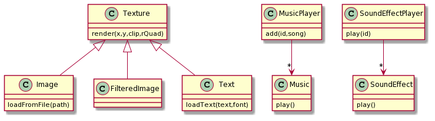
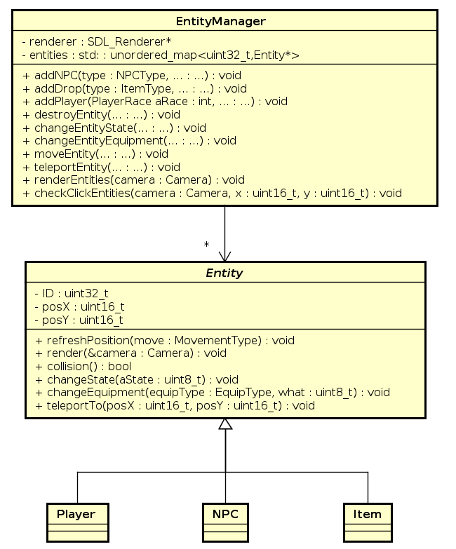
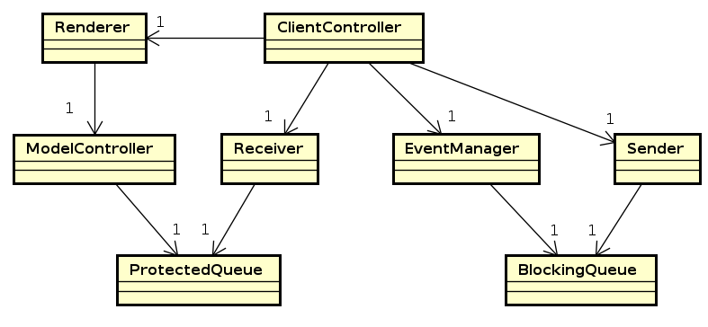
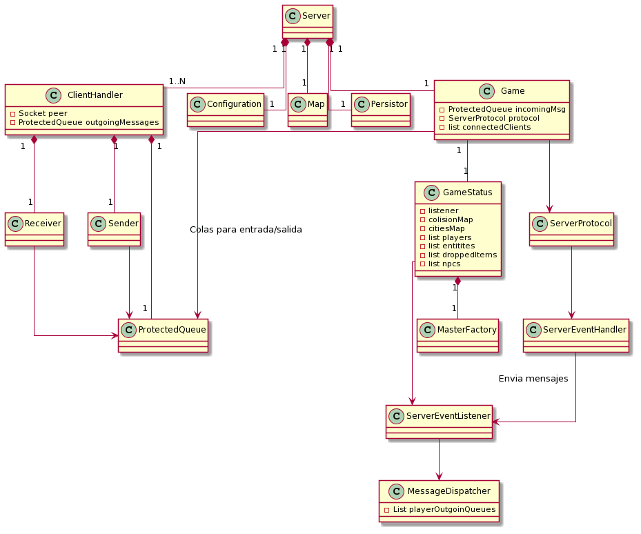

# Documentación Técnica

## Requerimientos de software

- **OS requerido**:

    - Linux

- **Bibliotecas requeridas**:

    - msgpack: https://github.com/msgpack/msgpack-c/tree/cpp_master
    - SDL2: https://www.libsdl.org/
    - QT: https://www.qt.io/product/framework

- **Herramientas para la instalación del programa**:

    - g++
    - Makefile
    - CMake

- **Herramientas para compilación, desarrollo, prueba y depuración del programa**:

    - Algún compilador de C++, por ejemplo, g++.
    - Algún editor de texto o IDE, por ejemplo, Visual Studio Code.

## Descripción general

El programa consiste de dos aplicaciones, un servidor, y un cliente, cada uno de estos posee diversos modulos que interactuan entre si, a continuación se desarrollaran cada uno de estos modulos.

## Cliente:

### Módulo WRAP_SDL

Este módulo se encarga de wrappear las funcionalidades de SDL, para ser capaz de utilizarlo sin preocuparse de su funcionamiento interno, las clases que componen este módulo son

        - Texture
        - Image
        - FilteredImage
        - Text
        - Music
        - SoundEffect
        - MusicPlayer
        - SoundEffectPlayer

La clase Texture, encapsula el renderizado de una textura, y las clases Image, FilteredImage y Text descienden de esta, ya que tienen un comportamiento similar entre si, Image corresponde a una imagen en formato png o similar, mientras que FilteredImage corresponde a una imagen png, pero con la posibilidad de que esta se transparente en relación a su entorno, por último Text encapsula un texto, que para SDL, una vez elegido el texto, funciona exactamente igual que una textura.

Luego, la clase Music y la clase SoundEffect encapsulan la reproducción de musica y Chunks (efectos de sonido), estas representan una unica musica o efecto de sonido, por otro lado, MusicPlayer y SoundEffectPlayer, funcionan como un reproductor, el al cual se le pueden agregar canciones o sonidos respectivamente, y luego elegir cual reproducir entre ellos.

Diagrama de clases

### Módulo Layout

Este módulo consiste de todas las clases que intervienen en el manejo del layout, es decir, la interfaz gráfica del juego, estas clases son:

        - Layout
        - ExpBar
        - GraphicInventory
        - LayoutManager
        - MiniChat

La clase Layout posee el background de la interfaz, y se encarga de graficar todo lo relacionado con la vida, el mana, el oro y el nivel.
ExpBar, como lo indica su nombre, representa la barra de experiencia, la cuál son dos imagenes, una barra vacia y una llena, que se grafican una sobre la otra dependiendo la cantidad de experiencia que se tenga.
GraphicInventory representa el inventario, el cuál grafica los distintos objetos del inventario, y aquellos que se encuentran equipados, además es capaz de saber en que slot esta clickeando un usuario para seleccionar un item.
La clase MiniChat posee un historial de mensajes el cuál es graficado, y es capaz de, si el usuario presiona ENTER, graficar dinamicamente lo que el usuario va escribiendo, y una vez presionado ENTER nuevamente, ese mensaje se agrega al historial, por lo que se grafica junto a los demas.
Por último la clase LayoutManager, se encarga de decodificar los mensajes llegados desde el servidor, y llamar a las funciones correspondientes de las clases explicadas anteriormente.

### Módulo Login

Este módulo representa la pantalla de Login o el Launcher, consiste en las siguiente clases

        - LogIn
        - LogInController

La clase LogIn es la que implementa la pantalla de Login, utilizando la libreria QT, en esta pantalla, primero se selecciona el servidor al cual se quiere conectar, obteniendo un mensaje de error si este no es valido, una vez conectado se ingresa el usuario y contraseña,junto con el tamaño de la ventana que querra que tenga el juego, en caso de que el usuario exista y la contraseña sea incorrecta se le notificara el error, si el usuario no existe, se pasara a la pantalla de creacion de personaje, en la que se debera seleccionar la raza, la clase, luego de esto, o si el usuario ya existia y la contraseña era correcta, la aplicacion finaliza.

LogInController se encarga de inicializar el LogIn y ejecutar la Qapplication, para que la ventana pueda correr, y devuelve si hubo algun error.

Todo este sistema es independiente al resto del juego, debido a que este esta implementado con SDL, a continuacion se explicara mas en detalle la implementación del LogIn:

El LogIn consiste en dos campos en los que se puede ingresar texto, y dos botones que pueden ser pulsados, uno de ellos es el boton de EXIT, que esta conectado a la función que termina el programa, en caso de ser pulsado (o en caso de cerrar el programa con la cruz de la ventana), el programa termina, y el juego principal no es iniciado.
El otro boton depende de la etapa en al que se encuentre, en la primer etapa, es el boton de conectar y esta linkeado a la funcion connecSrv, que ejecuta la conexion al server, y si es exitosa, se llama a la funcion que conecta el boton a la función SigIn, en esta función, si el boton es pulsado, se enviara al servidor los datos del usuario y la contraseña y dependiendo de la respuesta se mostrara un error, se iniciara el juego o se pasara a la tercer pantalla.

### Módulo Entity

En este módulo se encuentran las distintas entidades.

- **Entity**: clase abstracta utilizada para identificar toda clase a la que sea útil considerar una entidad.
- **Player**: clase hija de Entity. Representa a los distintos jugadores.
- **NPC**: clase hija de Entity. Representa a los distintos NPC's y Mobs.
- **Item**: clase hija de Entity. Representa a los drops.
- **EntityManager**: clase encargada de manejar todas las acciones de las distintas entidades. Se encarga de la creación, movimiento, cambio de estado, destrucción, renderizado, etc.

Las diferencias entre cada clase hija de `Entity` es importante. La clase `Item` es la que menor comportamiento presenta, ya que solo se puede crear y destruir, no se puede mover, clickear, cambiar estado. La clase `NPC` tiene mayor comportamiento, ya que es además clickeable y movible. Pero la clase más completa es `Player`, ya que, además de todo lo mencionado anteriormente, puede cambiar de estado (vivo, muerto), y por lo tanto de renderizado, presenta cabeza además de cuerpo, equipamiento (el cual se puede modificar), y, además, la instancia del jugador principal es quien guía a la cámara para renderizar en distintos lugares del mapa.

En el diagrama se pueden ver las principales funciones de cada Clase y sus atributos. Si bien las clases hijas de `Entity` tienen muchos más atributos como la imagen asociada a cada uno, entre otras, no son esenciales para entender su funcionamiento.

Cada Entidad tiene un ID asociado, con el que `EntityManager` se va a encargar de manejar, guardando cada entidad en un mapa `std::unordered_map<uint32_t, Entity>` en el cual la clave es ese ID. El servidor se encarga de que cada ID sea único para no tener conflictos entre entidades. Las funciones mencionadas en `Entity` son las que utiliza `EntityManager` para manjear estas entidades, pero no todas implementan una funcionalidad. Por ejemplo, los `Item`'s no son clickeables, por lo que siempre devuelven `false` al chequear si fueron clickeados.

De parte del cliente, los NPC's y los Mobs no son tan distintos. La única diferencia es que los NPC's, como `Banker` o `Healer`, tienen velocidad 0, ya que no se pueden mover de su posición original.

También existe una clase `Equippable` utilizada por `Player` para equiparse. No se utiliza `Item` ya que no es una entidad y, además, se necesita de un `sprite` más completo, con cada tile para ser renderizado a la par del movimento del jugador.

### Módulo ClientController

En este módulo se encuentran las clases que se ejecutan una vez cargado el cliente y son aquellas que se ejecutarán a lo largo del programa mientras se encuentre estable el servidor. Estas clases son:

- **Renderer**: clase hija de `Thread` encargada de renderizar el módelo en cada loop. Además, contiene también un `ModelController`, encargado de actualizar el modelo a través de eventos que obtiene a través de una cola de eventos conectada a `Receiver`, que se ejecuta en cada loop antes de renderizar.
- **Receiver**: clase hija de `Thread` encargada de recibir mensajes del servidor, desempaquetarlos y pushearlos a una cola de eventos conectada al `ModelController`.
- **EventManager**: clase encargada de tomar los eventos del usuario y, a través del la codificación del evento con `ClientProtocol`, pushear a una cola de eventos conectada a `Sender`.
- **Sender**: clase hija de `Thread` encargada de tomar los eventos de una cola de eventos conectada a `EventManager`, empaquetarlos y enviarlos al servidor.

Cada una de estas clases se ejecuta en un hilo distinto. EventManager se ejecuta en el hilo principal ya que la función `SDL_WaitEvent()` debe ser llamada en el mismo hilo en el que se inicializo la pantalla del juego.

Estas clases son ejecutadas y finalizadas en una clase llamada `ClientController`.

## Servidor:

### Flujo principal del servidor:

El servidor a muy alto nivel consiste basicamente en un programa que toma input de una cola(cola de eventos entrantes), que lo parsea y procesa y realiza los chequeos necesarios y hace las modifiaciones necesarias en el estado del juego, a medida que se va modificando el estado del juego, se van depositando actualizacion del estado en las colas de cada cliente que este conectado, en otro hilo a parte se toman cosas de la cola y se procede a enviarsela al cliente asociado, se muestra un diagrama con las clases mas importantes para esto:

### Inicializacion del servidor:

Cuando arranca el server, este crea todas las clases que van a hacer falta para poder correr el loop de juego y aceptar/procesar clientes que se quieren conectar.

El proceso que se realiza es:

1. Cargar el archivo de configuración
2. Cargar el mapa que se va a enviar a los usuarios
3. Crear el eventHandler y eventListener
4. Crear el mundo del juego e incializarlo
5. Lanzar el loop del juego(en otro hilo)
6. Esperar clientes

Cuando se crear el mundo(GameState) del juego se inicializan a su vez los NPCs, cierta cantidad de mobs que habitan el mundo.

### Entidades

-

### Items

-

## Protocolo

El protocolo para la comunicación entre el servidor y el cliente, es en formato binario, y consta del largo del mensaje, y un vector de uint32 codificado usando msgpack, se explica en el archivo Protocolo.md.

## Programas intermedios y de prueba

Algunos programas intermedios usados fueron:

    - Un programa sencillo en el que se testeaba la persistencia, persistiendo algunos usuarios, y viendo que al volver a correr el programa, era posible despersistirlos.
    - Un programa de prueba para la configuración, donde se parseaba el archivo y se verificaba que el contenido fuera el correcto.
    - Un programa en el cual se testeo el correcto funcionamiento del Layout, generando de manera local los cambios necesarios, como la actualización del oro, vida, agregar items al inventario, escribir en el chat, etc.
    - Un servidor de prueba para testear el cliente, harcodeando los mensajes a enviar y viendo que el cliente los recibia correctamente, y además podía enviar sus mensajes al servidor.

## Código Fuente

El código fuente se encuentra en el repositorio de github

[Link al repositorio](https://github.com/gianbelinche/Taller-TP-Final)
