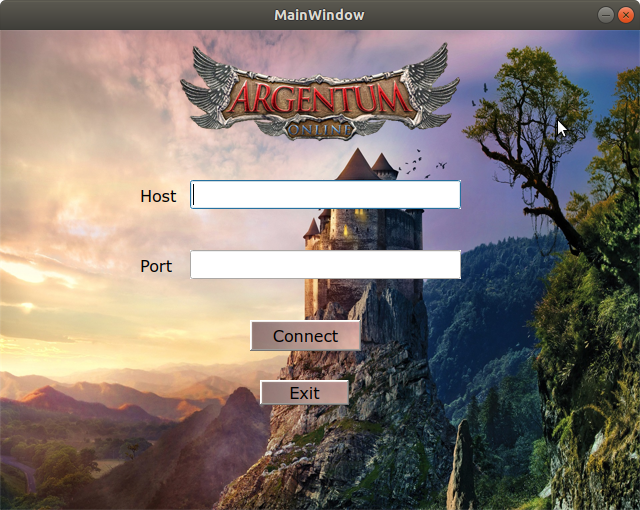
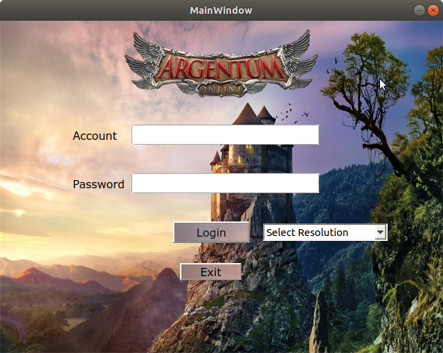
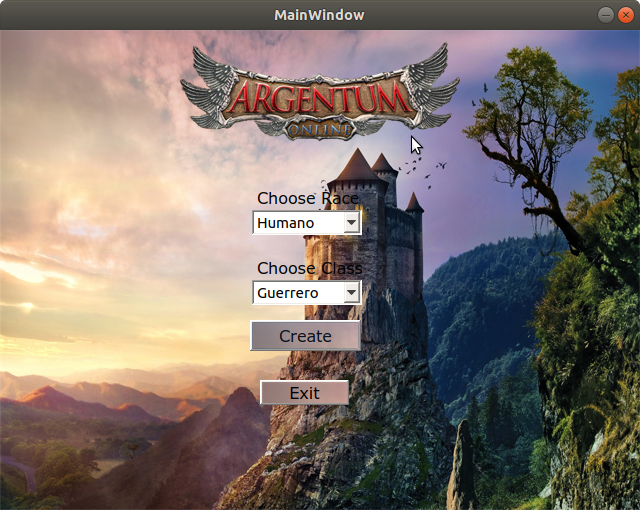
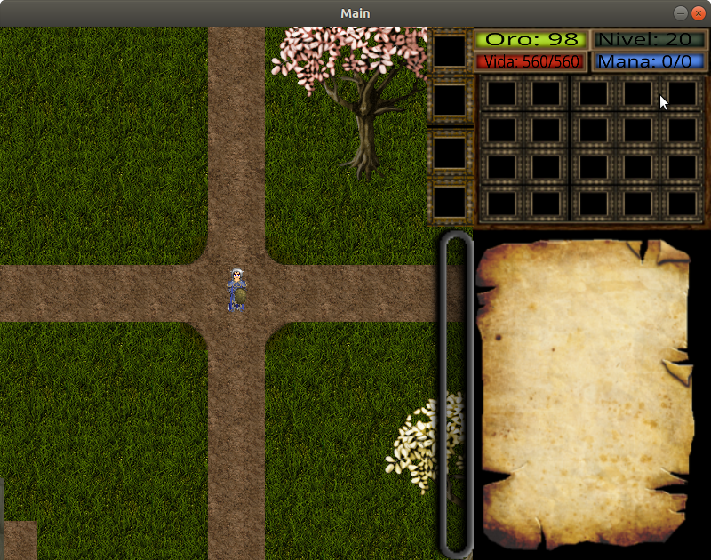
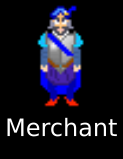
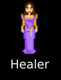
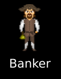

# Manual de Usuario

## Instalación

### Requerimientos de Software

- **OS requerido**: 
        - Linux
        - ***MacOS??***
        - ***Windows??***

- **Bibliotecas requeridas**:
        - jsoncpp: https://github.com/open-source-parsers/jsoncpp
        - msgpack: https://github.com/msgpack/msgpack-c/tree/cpp_master
        - SDL2: https://www.libsdl.org/
        - QT: https://www.qt.io/product/framework
        - ***COMPLETAR***

- **Herramientas para la instalación del programa**:
        - ***CMake??***
        - ***Makefile?***

### Requerimientos de Hardware

El programa fue probado con las siguientes tres especificaciones de hardware:

1. Primera computadora:

    - Procesador AMD 10-7850K
    - 16 GB de RAM
    - Placa de Video Radeon R9 380

2. Segunda computadora:

    - Procesador Intel i7 8700
    - 16 GB de RAM
    - Placa de Video GTX 1080Ti

2. Tercera computadora:

    - ***COMPLETAR***
    - ***COMPLETAR***
    - ***COMPLETAR***

Se asegura que el programa funcionará en sistemas con especificaciones similares o superiores.

### Proceso de instalación

***COMPLETAR***

## Configuración

Se provee un archivo de configuración en formato JSON, el cual contiene todas las variables que pueden ser modificadas para cambiar el comportamiento del programa.

Las distintas variables configurables son:
    - Frames por segundo
    - Puerto del servidor
    - Datos iniciales del jugador
    - Vida, daño y nivel de los enemigos
    - Distintos factores de las razas y clases
    - Caracteristicas de los objetos, como daño, defensa o rango

Para la resolución de la ventana, se provee una selección de resoluciones al momento del login.

## Forma de uso

En caso de que ningun server se encuentre abierto, se debe iniciar un server. Para eso, se debe modificar, si se desea, el archivo de configuración gameConfig.json que se encuentra en ~/server_src/config/gameConfig.json.

Luego, se debe ejecutar el servidor de la siguiente manera:

~~~
/server config/gameConfig.json
~~~

Para la conexión del cliente se debe iniciar el programa ejecutando el comando `./client` en la terminal, y en la pantalla que aparece ingresar el host y puerto para conectarse a un servidor. En caso de que el servidor ingresado no exista o halla algún otro tipo de error, se mostrará por pantalla y deberá volver a intentarse conectar.

Una vez conectado al servidor, se le pedirá el ingreso de un usuario y contraseña. En caso de que sea la primera vez que ingresa, se creará un nuevo usuario junto a la contraseña ingresada, siempre que no exista un usuario con el mismo nombre, en caso de que no sea la primera vez que se conecta, ingresará su usuario y contraseña y si esta es correcta, podrá iniciar el juego, en caso contrario, se le notificará del error.

Si es la primera vez que entra al juego, aparecera una pantalla de creación de personaje, donde tendrá un menu desplegable desde el que podrá elegir su raza y su clase. 

Entre las razas, se encuentran:

- ​ Humanos​ : son una raza equilibrada.
- ​ Elfos​ : son muy inteligentes y ágiles pero de una constitución física frágil
- ​ Enanos​ : son muy fuertes y resistentes, pero la agilidad no es lo suyo - ​ Gnomos​ : inteligentes y resistentes, pero mucho menos ágiles que los elfos.

Y entre las distintas clases, están:

- ​ Mago​ : quienes hayan estudiado magia han cultivados sus mentes y menos sus cuerpos.
- ​ Clérigo​ : un poco menos inteligentes y hábiles que los magos, un clérigo compensa sus falencias con un mayor desempeño físico.
- ​ Paladin​ : entrenados para el combate, son fuertes y resistentes aunque capaces también de usar magia, con una mucho menor inteligencia que un mago.
- ​ Guerrero​ : han dedicado toda su vida al combate, son típicamente más fuertes y resistentes que otros pero carecen de la sabiduría para usar la magia.

De todas las clases, el guerrero es el único que no puede usar la magia, ni meditar y su mana es siempre 0.

Una vez iniciado el juego, se podrá observar el personaje en el pueblo principal, observando la siguiente escena:

En cada uno de los tres pueblo, el personaje estará seguro de todo ataque, ya que estos son zona segura. Además, se podrán encontra, en cada pueblo, un `Merchant` o `Mercader`, una `Healer` o `Sanadora` y un `Banker` o `Banquero`. 

|  |  |  |
|:-:|:-:|:-:|

Más adelante se hablará sobre cómo interactuar con cada uno de estos.

El personaje creado tiene una cantidad de vida y mana iniciales dependiendo de la raza y clase elegida. También cuenta con experiencia y niveles, los cuales irán aumentando a medida que vaya matando mounstros o mobs. Además, deberá encontrar equipamiento a través de los drops de los mobs, o juntando oro y comprando a los correspondientes NPC's.

El personaje puede moverse con las teclas `WASD`. También se puede observar un `Layout`, en el que se muestra la cantidad de oro, vida, mana y nivel actuales, junto con una barra que representa la experiencia y se ira llenando a medida que se obtiene. Además, se puede observar unos slots que corresponden al inventario, y a medida que consigan objetos se iran llenando. El inventario puede ser clickeado para seleccionar un objeto, también hay 4 slots especiales en donde figuraran los objetos equipados actualmente. Por último se encuentra una ventana de chat, en la que apretando `ENTER` podrá empezar a escribir, y apretando `ENTER` nuevamente, enviará el mensaje ingresado.

Estos mensajes se deberán escribir en forma de distintos comandos:

- **/meditar**: El jugador entra en estado de meditación y recupera mana.
- **/resucitar**: Si el jugador es un fantasma, tiene dos opciones, utilizarlo a la lejanía o hacer click con anterioridad a una sanadora. Si lo usa en la lejanía, se traslada a la ciudad más cercana y resucita. Sino, se debe haber hecho click en una sanadora y, luego de escribir el comando, resucita.
- **/curar**: Recupera los puntos de vida y maná. El mensaje debe ser escrito luego de hacer click en una sanadora.
- **/depositar \<objeto>**: Toma el objeto del inventario del jugador y lo pone en el banco. El mensaje debe ser escrito luego de hacer click en un banquero.
- **/retirar \<objeto>**: Recupera un objeto del banco y lo guarda en el inventario. El mensaje debe ser escrito luego de hacer click en un banquero.
- **/listar**: Lista los objetos que el mercader tiene para vender o los que el banquero tiene. El mensaje debe ser escrito luego de hacer click en un banquero o mercader.
- **/comprar \<objeto>**: Comprar un objeto. El mensaje debe ser enviado a una sanadora o mercader. El mensaje debe ser escrito luego de hacer click en un sanadora o mercader.
- **/vender \<objeto>**: Vende un objeto. El mensaje debe ser enviado a un mercader.
- **/tomar**: Recoge del suelo un objeto y lo guarda en el inventario.
- **/tirar**: Tira el objeto del inventario seleccionado. El mensaje debe ser escrito luego de hacer click en slot del inventario.
- **/equipar**: Equipa el objeto del inventario seleccionado. El mensaje debe ser escrito luego de hacer click en slot del inventario.
- **@\<nick> \<msj>**: Le envía un mensaje privado a otro jugador.

[//]: # (Deberíamos hablar de los distintos tipos de mobs y armas del juego)

## Apéndice de errores

***COMPLETAR***